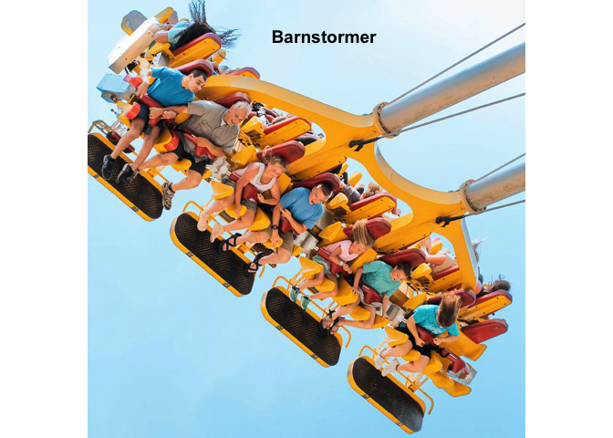

<!-- README.md is generated from README.Rmd. Please edit that file -->

# Dollywood Attraction Directory Explorer

The `Dollywood` package allows users to explore the rides and
attractions at \[Dollywood Amusement Park\]
(<https://www.dollywood.com/>) in Pigeon Forge, Tennessee. Users of this
package have the ability to search for and filter these attractions
based on factors like their name, their location in the park, and more.

In addition, users have the ability to pull an image of each attraction.

<!-- badges: start -->

[](https://github.com/abbyhunt24/sds270project/actions/workflows/R-CMD-check.yaml)
[](https://app.codecov.io/gh/abbyhunt24/sds270project)
<!-- badges: end -->

The `Dollywood` package provides an R interface to retrieve data about
[Dollywood rides](%22https://www.dollywood.com/themepark/rides/%22).

## Installation

You can install the development version of Dollywood from
[GitHub](https://github.com/) with:

``` r
# install.packages("pak")
pak::pak("abbyhunt24/sds270project")
```

## Usage

This package allows users to filter the Dollywood attractions for a
variety of characteristics. The following is an example of using the
`dolly_search()` function to search for a ride by name.

In addition, the `ride_pic()` function allows users to generate an image
of each ride.

This package allows users to filter the Dollywood attractions for a
variety of characteristics. The following is an example of using the
`dolly_search()` function to search for a ride by name and the
`ride_pic()` function to see an image of that ride.

``` r
library(dollywoodR)

barnstormer <- dolly_search(rides_df, "name", "Barnstormer")
str(barnstormer)
#> Classes 'tbl_df', 'tbl' and 'data.frame':    1 obs. of  8 variables:
#>  $ name          : chr "Barnstormer"
#>  $ location      :List of 1
#>   ..$ : chr "Owens Farm"
#>  $ description   : Named chr "Barnstormer Seated back to back, riders travel progressively higher on each swing of the Barnstormer’s massive "| __truncated__
#>   ..- attr(*, "names")= chr "https://www.dollywood.com/themepark/rides/barnstormer/"
#>  $ image         : chr "https://hfe.widen.net/content/lginpfj9rc/jpeg/DW22_Accessibility_Ride_Barnstormer_Operating%20-%20Copy.jpg?crop"| __truncated__
#>  $ height        : Named chr "Min: 48 inches Max: No Max"
#>   ..- attr(*, "names")= chr "https://www.dollywood.com/themepark/rides/barnstormer/"
#>  $ type          : Named chr "Types: Thrill TimeSaver Eligible"
#>   ..- attr(*, "names")= chr "https://www.dollywood.com/themepark/rides/barnstormer/"
#>  $ safety        : Named chr "Guests will experience accelerating forces on this large swing that features two pendulum arms, each of which a"| __truncated__
#>   ..- attr(*, "names")= chr "https://www.dollywood.com/themepark/rides/barnstormer/"
#>  $ recomendations: Named chr "Drop Line® The Mad Mockingbird The Scrambler The Waltzing Swinger Lemon Twist"
#>   ..- attr(*, "names")= chr "https://www.dollywood.com/themepark/rides/barnstormer/"

barnstormer_pic <- ride_pic(rides_df, "Barnstormer")
```


